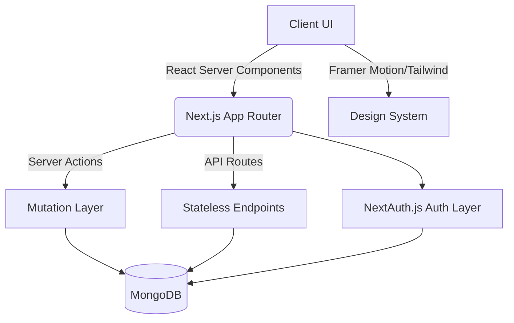

<div align="center">
  
# 🌌 COLLAB-SPACE
### *A Next-Generation Workspace for High-Performance Teams*

[](https://nextjs.org/)
[](https://www.typescriptlang.org/)
[](https://www.mongodb.com/)
[](https://tailwindcss.com/)
[](https://www.framer.com/motion/)

[Live Demo](https://github.com/yokshith09/COLLAB-SPACE) • [Report Bug](https://github.com/yokshith09/COLLAB-SPACE/issues) • [Request Feature](https://github.com/yokshith09/COLLAB-SPACE/issues)

</div>

---

## ✦ Overview

**COLLAB-SPACE** is an enterprise-grade, deeply integrated workspace designed to bridge the gap between ideation and seamless execution. Built for modern product teams, open-source communities, and agile startups, the platform offers a centralized ecosystem that eradicates the friction of context-switching between fragmented tools.

By converging robust task management, real-time communication, and intelligent resource tracking, **COLLAB-SPACE** serves as the definitive command center for executing complex projects from inception to deployment.

---

## ✦ Core Capabilities

<table align="center">
  <tr>
    <td width="50%">
      <h3>👤 Dynamic Talent Profiles</h3>
      <p>Curated portfolios that aggregate skills, domain expertise, GitHub commits, LinkedIn presence, and resumes, algorithmically positioning individuals for optimal team synergy.</p>
    </td>
    <td width="50%">
      <h3>🛠 Project & Milestone Hub</h3>
      <p>Comprehensive project command centers. Establish multi-phase milestones, map out required technical competencies, and visually track global project progression in real-time.</p>
    </td>
  </tr>
  <tr>
    <td width="50%">
      <h3>👥 Dedicated Team Enclaves</h3>
      <p>Isolated, high-focus workspaces for granular teams, seamlessly integrating contextual chat channels, shared cryptographic notes, and agile task boards.</p>
    </td>
    <td width="50%">
      <h3>🎯 Agile Task Matrix</h3>
      <p>Sophisticated Kanban-style task orchestration featuring dynamic assignee routing, automated deadline tracking, and multi-tier priority stratification.</p>
    </td>
  </tr>
  <tr>
    <td width="50%">
      <h3>💬 Synchronous Communication</h3>
      <p>Low-latency instant messaging and persistent discussion boards architected specifically for deep-dive technical deliberations and rapid alignment.</p>
    </td>
    <td width="50%">
      <h3>🏆 Gamified Engagement</h3>
      <p>Built-in telemetry tracking contribution velocity, activity heatmaps, and milestone leaderboards to foster a culture of continuous delivery and recognition.</p>
    </td>
  </tr>
</table>

---

## ✦ Technical Architecture

COLLAB-SPACE is engineered on a resilient, bleeding-edge modern web stack ensuring uncompromising performance, horizontal scalability, and top-tier developer ergonomics.

### The Stack

* **Framework:** Next.js 14 utilizing the revolutionary App Router for unparalleled server-side rendering and static generation.
* **Language:** TypeScript operating under strict configuration to guarantee end-to-end type safety and catch logical flaws at compile time.
* **Database Layer:** MongoDB interfaced through Mongoose, providing a flexible schema structure adapted for rapidly mutating application states.
* **Authentication:** NextAuth.js (v5) providing hardened credential validation, advanced session management, and seamless OAuth provider integrations.

### Design System & UI

* **Styling Engine:** Tailwind CSS for highly deterministic, utility-first styling.
* **Component Library:** Radix UI primitives ensuring uncompromising accessibility (a11y) standards and unstyled architectural freedom.
* **Animation & Micro-interactions:** Framer Motion for liquid-smooth transitions, physics-based UI elements, and a distinctly premium user feel.

---

## ✦ Codebase Architecture



<details>
<summary><b>Directory Structure (Expand)</b></summary>
<br>

```text
COLLAB-SPACE/
├── src/
│   ├── actions/        # Cryptographically secure Server Actions for state mutations
│   ├── app/            # Next.js App Router hierarchy (Pages, Layouts, APIs)
│   ├── components/     # Composable UI primitives and domain-specific macros
│   ├── lib/            # Core utilities, DB connection singletons, and schemas
│   └── types/          # Immutable TypeScript global type definitions
├── public/             # Optimized static media assets
└── config/             # Environment-agnostic configuration maps
```
</details>

---

## ✦ Development Roadmap

Our engineering team is actively building the next generation of features. Here is what is on the horizon:

- [ ] **Real-Time Telemetry:** Integration of WebSockets for instantaneous UI mutations without polling.
- [ ] **AI Contextual Insights:** Intelligent task delegation and timeline forecasting powered by LLMs.
- [ ] **Extensibility Hooks:** Slack, Discord, and native GitHub Action webhooks.
- [ ] **Native Video/Audio:** WebRTC-powered synchronous stand-ups directly within the team enclave.

---

## ✦ Contribution Guidelines

We champion open-source contribution and peer-reviewed excellence. To contribute:

1. **Fork** the repository to your local environment.
2. **Branch** off for your feature (`git checkout -b feature/quantum-optimization`).
3. **Commit** using conventional commit standards.
4. **Push** and open a comprehensive Pull Request detailing architectural decisions.

---

## ✦ Licensing

This software is distributed under the prestigious **MIT License**. See the `LICENSE` file for extensive legal parameters.

<div align="center">
  <br>
  <i>Architected with precision by the COLLAB-SPACE Engineering Team.</i>
</div>
