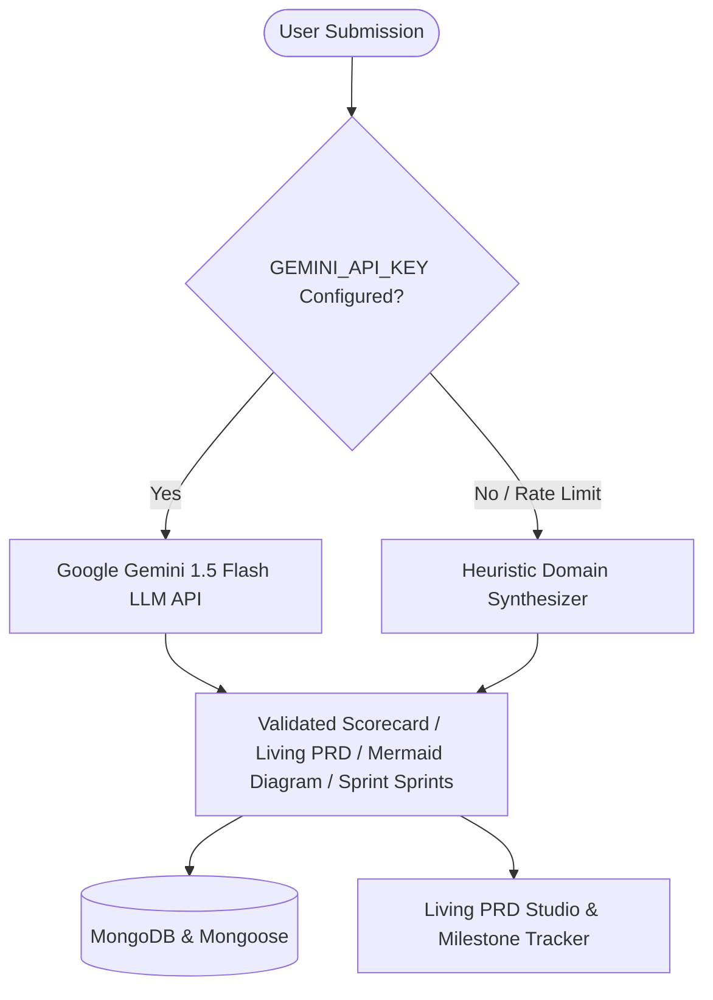

<div align="center">
  
# 🌌 COLLAB-SPACE
### *The AI-Augmented Product Workspace & Team Matchmaking Platform*

[](https://nextjs.org/)
[](https://www.typescriptlang.org/)
[](https://tailwindcss.com/)
[](https://www.mongodb.com/)
[](https://aistudio.google.com/)
[](https://github.com/yokshith09/COLLAB-SPACE/actions)
[](https://opensource.org/licenses/MIT)

[Explore Projects](https://github.com/yokshith09/COLLAB-SPACE) • [Living PRD Studio](https://github.com/yokshith09/COLLAB-SPACE) • [Report Bug](https://github.com/yokshith09/COLLAB-SPACE/issues) • [Request Feature](https://github.com/yokshith09/COLLAB-SPACE/issues)

</div>

---

## ✦ Overview

**CollabSpace** is an all-in-one collaborative ecosystem designed for student developers, indie hackers, and open-source creators to stress-test ideas, generate Living Product Requirement Documents (PRDs), recruit compatible teammates, and manage sprint milestones toward production launch.

By combining deep **AI idea validation**, **automated technical specification generation**, **interactive Mermaid architecture mind maps**, and **real-time team workspaces**, CollabSpace bridges the gap between raw idea brainstorming and shipping deployed software.

---

## ✦ Core Feature Ecosystem

<table>
  <tr>
    <td width="50%">
      <h3>🧠 AI Idea Viability Validator</h3>
      <p>Evaluate project submissions across a 5-dimension scorecard (Problem Clarity, MVP Feasibility, Technical Moat, Contributor Attractiveness, Market Traction) with actionable blind-spot detection and a 1-click Pitch Enhancer.</p>
    </td>
    <td width="50%">
      <h3>📄 Living PRD Studio</h3>
      <p>Synthesize complete technical PRDs from simple pitches. Includes feature hierarchies, system architectures, database schemas, REST API contracts, and direct Markdown (<code>.md</code>) export.</p>
    </td>
  </tr>
  <tr>
    <td width="50%">
      <h3>🗺️ Interactive Mermaid Mind Maps</h3>
      <p>Auto-generate dynamic architecture diagrams, user flowcharts, and Entity-Relationship (ER) schemas rendered client-side with smooth zoom, pan, and SVG export controls.</p>
    </td>
    <td width="50%">
      <h3>📋 Spec-to-Kanban Decomposition</h3>
      <p>Transform PRD specifications into actionable Kanban cards with 1 click, automatically tagging technical competencies and injecting tasks directly into the Team Workspace.</p>
    </td>
  </tr>
  <tr>
    <td width="50%">
      <h3>🎯 Sprint Milestone & Reminder Engine</h3>
      <p>Break project roadmaps into 4 agile sprint milestones with interactive deliverable checklists, real-time progress calculations, and automated 48-hour team reminders to prevent project staleness.</p>
    </td>
    <td width="50%">
      <h3>🤝 AI Matchmaking & Direct Invites</h3>
      <p>Discover compatible talent through AI skill-radar matching or dispatch direct collaboration invitations to active platform builders with personalized role pitches.</p>
    </td>
  </tr>
  <tr>
    <td width="50%">
      <h3>💬 Private Team Enclaves</h3>
      <p>High-focus collaborative workspaces featuring real-time group chat channels, shared scratchpad notes, drag-and-drop agile task boards, and GitHub commit webhook synchronization.</p>
    </td>
    <td width="50%">
      <h3>🏆 Builder Profiles & Gamification</h3>
      <p>Curated talent portfolios showcasing GitHub commits, LinkedIn presence, skill endorsements, activity heatmaps, reputation points, and leaderboard standings.</p>
    </td>
  </tr>
</table>

---

## ✦ Dual-Engine AI Architecture

CollabSpace implements a resilient **Dual-Engine AI Architecture**:



- **Live LLM Engine (Google Gemini 1.5 Flash):** High-speed, structured JSON schema outputs performing deep contextual reasoning and technical specification generation.
- **Zero-Crash Contextual Fallback:** When offline or without API keys, an intelligent domain synthesizer computes metrics, blind spots, PRDs, Mermaid diagrams, and sprint milestones directly from project input parameters.

---

## ✦ Tiered Business Model & 30-Day Free Trial

CollabSpace includes a full-featured subscription model with an **automatic 30-day all-access free trial**:

| Feature / Quota | **Community Starter (Free Forever)** | **Pro Builder Studio ($19/mo or $15/mo annual)** |
| :--- | :--- | :--- |
| **Active Projects** | **Up to 2 projects** | **Up to 25 projects** |
| **Max Team Size** | Up to 4 members | Up to 12 members |
| **AI Idea Validations** | **5 / month** | **100 / month** |
| **Living PRD Generations** | **2 / month** | **50 / month** |
| **Sprint Milestone Roadmaps** | **2 / month** | **50 / month** |
| **AI Intelligence Engine** | Standard Contextual Synthesizer | **Deep Google Gemini 1.5 Flash LLM** |
| **Specification Export** | Web View | **Direct Markdown (.md) Download** |
| **Milestone Reminders** | Manual in-app triggers | **Automated 48h Team Cron Reminders** |
| **Profile Recognition** | Standard Profile | **"Pro Builder" Gold Badge & +100 Rep Points** |

> **🎁 30-Day All-Access Free Trial:** Every new account receives full Pro-tier privileges free for the first 30 days. Paid subscription billing activates only after the trial concludes.

---

## ✦ Technical Architecture & Tech Stack

```text
COLLAB-SPACE/
├── src/
│   ├── actions/                  # Next.js Server Actions (Auth, AI, PRD, Milestones, Subscriptions)
│   ├── app/                      # App Router (Pages, Dashboard, Projects, Teams, Pricing, APIs)
│   │   ├── (dashboard)/          # Authenticated routes (Dashboard, Pricing, Projects, Profile)
│   │   └── api/                  # REST APIs & Background Cron Workers (/api/cron/*)
│   ├── components/               # Modular UI Primitives & Domain Features
│   │   ├── milestones/           # Interactive Milestone Steppers & Deliverable Checklists
│   │   ├── project/              # Living PRD Studio, Mermaid Viewer, Idea Validator Modal
│   │   ├── subscription/         # Pricing Hub, Upgrade Modal, Quota Meter Badges
│   │   ├── team/                 # Private Team Enclave & Kanban Workspace
│   │   └── ui/                   # Accessible Radix UI Primitives & Toast Notifications
│   └── lib/                      # Core Services, Models, MongoDB, AI Rate Limiter & Plans
├── .github/workflows/ci.yml      # Automated GitHub Actions CI/CD Pipeline
└── public/                       # Static Assets & Branding
```

### Core Technologies
- **Framework:** [Next.js 16 (App Router)](https://nextjs.org/)
- **Language:** [TypeScript 5 (Strict Mode)](https://www.typescriptlang.org/)
- **Styling:** [Tailwind CSS](https://tailwindcss.com/) + [Radix UI](https://www.radix-ui.com/)
- **Database & Models:** [MongoDB](https://www.mongodb.com/) + [Mongoose](https://mongoosejs.com/)
- **Authentication:** [NextAuth.js v5](https://authjs.dev/)
- **AI Intelligence:** [Google Gemini API](https://aistudio.google.com/)
- **Diagrams & Visuals:** [Mermaid.js (CDN Dynamic Injection)](https://mermaid.js.org/)
- **CI/CD:** [GitHub Actions](https://github.com/features/actions) + ESLint 9 Flat Config

---

## ✦ Quick Start & Local Setup

### 1. Clone the Repository
```bash
git clone https://github.com/yokshith09/COLLAB-SPACE.git
cd COLLAB-SPACE
```

### 2. Install Dependencies
```bash
npm install
```

### 3. Configure Environment Variables
Create a `.env.local` file in the root directory based on `.env.example`:

```env
# Database (MongoDB)
DATABASE_URL="mongodb+srv://<username>:<password>@cluster0.mongodb.net/collabspace?retryWrites=true&w=majority"

# Auth.js Secret (generate with: npx auth secret)
AUTH_SECRET="your-generated-auth-secret"
AUTH_URL="http://localhost:3000"

# Optional: Google Gemini AI (for live LLM reasoning)
# Get a free key at: https://aistudio.google.com/
GEMINI_API_KEY="AIzaSy..."

# Optional: Supabase (for realtime storage/chat) & Resend (for emails)
NEXT_PUBLIC_SUPABASE_URL="https://[PROJECT].supabase.co"
NEXT_PUBLIC_SUPABASE_ANON_KEY="eyJhbGci..."
RESEND_API_KEY="re_..."
```

### 4. Run Development Server
```bash
npm run dev
```
Open [http://localhost:3000](http://localhost:3000) in your browser.

### 5. Validate & Build
```bash
# Typecheck
npx tsc --noEmit

# Lint (ESLint 9 Flat Config)
npm run lint

# Production Build
npm run build
```

---

## ✦ Background Automated Cron Tasks

CollabSpace includes stateless, serverless cron endpoints:

- **`/api/cron/milestone-reminders`**: Periodically scans active project sprints and sends targeted in-app notifications to team members every 48 hours.
- **`/api/cron/expire-apps`**: Automatically expires unreviewed project applications after 14 days to prevent stale backlogs.
- **`/api/cron/archive-inactive`**: Archives projects with no team activity past their deadline.

---

## ✦ Contributing

Contributions are welcome! To contribute:

1. Fork the repository.
2. Create a feature branch (`git checkout -b feature/amazing-feature`).
3. Commit your changes (`git commit -m "feat: add amazing feature"`).
4. Push to your branch (`git push origin feature/amazing-feature`).
5. Open a Pull Request.

---

## ✦ License

Distributed under the **MIT License**. See `LICENSE` for more information.

<div align="center">
  <br>
  <i>Built with ❤️ for student builders, open-source teams, and creators worldwide.</i>
</div>
